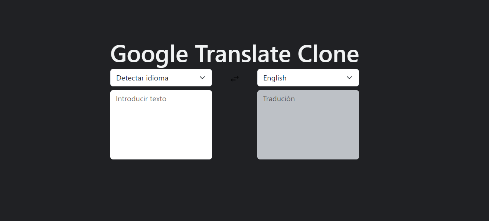

# Clon de Google Translate con ChatGPT

Este proyecto es un clon de Google Translate que utiliza TypeScript, React y ChatGPT para traducir palabras y frases en diferentes idiomas.

## Características

- Traducción de palabras y frases en tiempo real.
- Soporte para múltiples idiomas.
- Interfaz de usuario amigable.
- Integración con el modelo de lenguaje ChatGPT para mejorar la calidad de las traducciones.

## Demo



## Instalación

1. Clona el repositorio en tu máquina local:

``` bash
  git clone https://github.com/johssalinas/google-translate-clone.git
```

2. Instala las dependencias:

``` bash
    cd google-translate-clone
    npm install
```

3. Inicia la aplicación:

``` bash
    npm run dev
```

## Cómo usar

1. Ingresa la palabra o frase que deseas traducir en el campo de texto.
2. Selecciona el idioma de origen y el idioma de destino en los menús desplegables.

## Configuración de ChatGPT

Para habilitar la integración con ChatGPT y mejorar las traducciones, necesitas obtener una clave de API de OpenAI. Luego, modifica el archivo `.env` con la siguiente configuración:

``` jsx
    VITE_OPENAI_API_KEY="YOUR-API-KEY"
```

## Contacto

Si tienes alguna pregunta o inquietud relacionada con este proyecto, puedes contactarme a través de [johssalinas2work@gmail.com](mailto:johssalinas2work@gmail.com).

¡Gracias por tu interés en este proyecto!

### Johs Salinas
